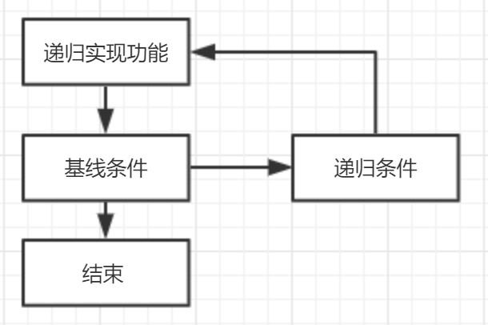

《算法图解》的读书笔记。
<!--more-->
### 大O表示法
大O表示法是指算法运行有多快，指出了算法运行时间的增速。用大O表示法表示算法运行时间。

常见的大O时间：
0.O(1)：常量时间
1.O(log n)：对数时间，二分查找
2.O(n)：线性时间，简单查找
3.O(n * log n)：快速排序（平均，最差情况为O(n^2)），合并排序（总是）（常用快速，而非合并，因为快速查找使用时间较短）
4.O(n^2)：选择排序
5.O(n!)：旅行商问题

### 数据结构
数组：读取速度快
链表：插入、删除速度快
栈：后入先出。所有函数调用都进入调用栈（调用栈过长会占用大量内存）
散列表：key-value

### 二分查找
仅当列表有序时，才管用。

### 选择排序
遍历列表，选择最大的值，添加进新的列表中。对余下的数组循环这个过程，直到全部排完。

### 递归
需要有基线条件和递归条件

#### 分而治之（D&C: divide and conquer）

1.找出基线条件
2.不断将问题分解（缩小规模），直到符合基线条件

#### 归纳证明
分为基线条件和归纳条件。
例：在基线条件中，证明算法对空数组或包含一个元素的数组有效；在归纳条件中，算法对一个元素的数组有效、对含两个元素的数组也有效（对含k个元素的数组管用，并对k+1个元素的数组也管用），那么可以推断出对任何元素的数组都管用。

### 快速排序
快速排序就使用D&C策略。
步骤：
1.随机选择基准值；
2.将数组分成两个子数组：小于基准值的和大于基准值的。
3.对这两个子数组进行快速排序。

### 散列表
散列函数要求：
1.散列函数必须是一致的。
2.不同输入映射不同输出结果。

散列函数特点：
1.散列函数总是将同样的输入映射到相同索引。
2.散列函数总是将不同的输入映射到不同的索引。
3.散列函数记录数组的大小，只返回有效索引。

用途：
1.用于快速查找，O(1)。
2.防止重复。
3.用于缓存。

优化冲突（两个不同键对于同个位置（需要使用链表存储，极端情况影响性能））：
1.较低的装填因子；
	装填因子=散列表包含的元素数/位置总数
	装填因子越低，发生冲突的可能性越小，散列表性能越高。
	常见规则：装填因子大于0.7，需要调整散列表长度。
2.良好的散列函数。
	避免“扎堆”
	例：SHA函数

### 广度优先搜索

### 狄克斯特拉算法

### 贪婪算法

### 动态规划

### K最近邻算法 